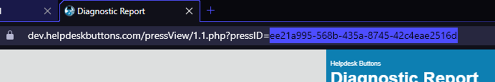
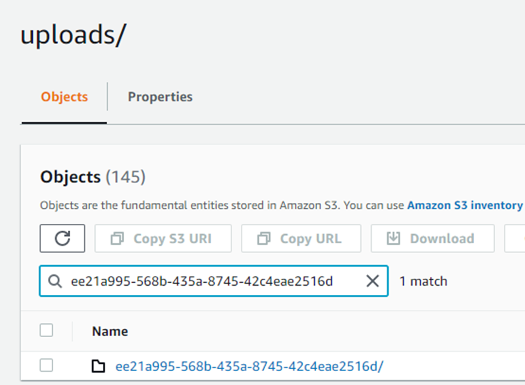
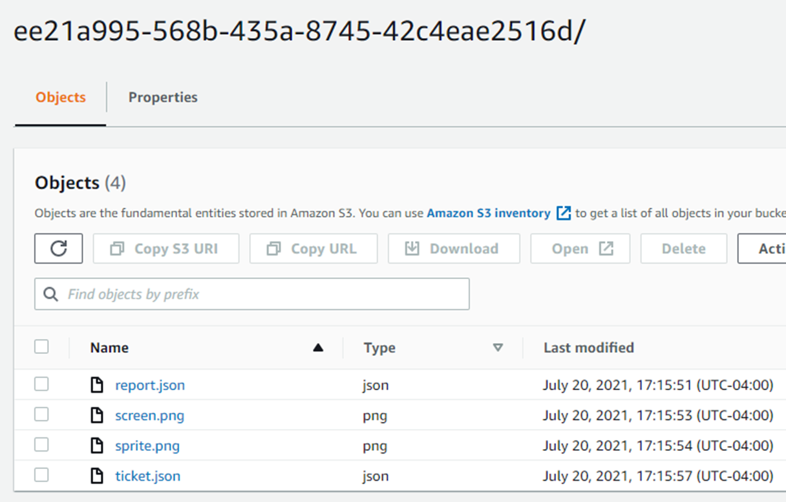
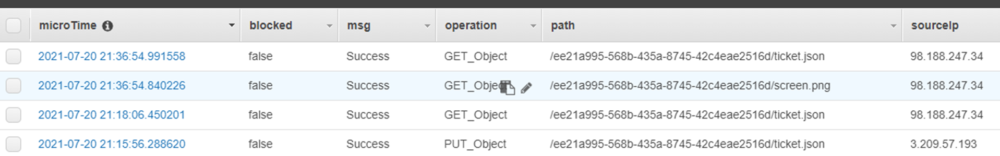

# Navigating your AWS 

## Accessing a specific reports files

Each ticket URL has a  “pressID” which corresponds to a folder in an S3 bucket

This is a folder in my test S3 bucket for uploads. 

*Note that the pressID can be used as a search term to find a folder*

Inside that folder should be the data that is parsed for that report

## Logging Data

Additionally, in DynamoDB there should be entries in a table (created by the gatekeeper) that logs all the access for any ticket report. 

These access portion of these raw logs is processed into a more readable format in our audit logs in your HDB/T2T account: 

[https://dev.helpdeskbuttons.com/auditReport.php](https://dev.helpdeskbuttons.com/auditReport.php)

