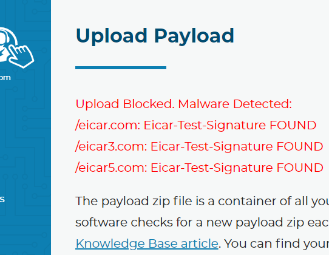

General Components
=====================

ButtonHelper
-------------

Our ButtonHelper executable runs on the system and takes screenshots when certain key inputs are hit by the user (mouse clicks, return, function keys, etc).

These screenshots are stored in memory until the user decides to submit a ticket. This data is never saved to disk. Once the ticket software is started, the collection scripts begin gathering information and processing the images into a compressed format. 

None of this information is sent from the machine without the affirmative consent of the user by default.

Custom Scripts
---------------

We allow users to create their own custom scripts and build them into the software. We scan these scripts with `ClamAV <https://www.clamav.net/>`_ and the helper files through a virus scanner before we allow them to be added to the builds, just in case. Other RMM platforms do not scan for malware for the things you upload and deploy. Although it might not always stop things, it’s better than doing nothing at all. This image is from a test via the Branding and Scripts page where you upload scripts.

Tier 2 Service
----------------

The system service is responsible for receiving commands to run and sends the output of those commands to our cloud infrastructure. It does this by establishing a WebSocket connection over TLS back to the command API. The TLS certificate of the cloud API must be valid for the connection to establish. Any commands coming into the service are also validated with an ECDSA signature. If the signature does not match the hardcoded public key, then the commands are ignored and the failure is logged.

The service also has the ability to send alerts/messages to the cloud services. To do so, the service must authenticate with the cloud servers by using a 256-bit authorization key that is unique to the machine and randomly generated upon install, or when the hard disk drive or motherboard serial number of the PC changes. This key is stored in the registry encrypted and the ACL of the registry key is such that non-administrators cannot view the value.

