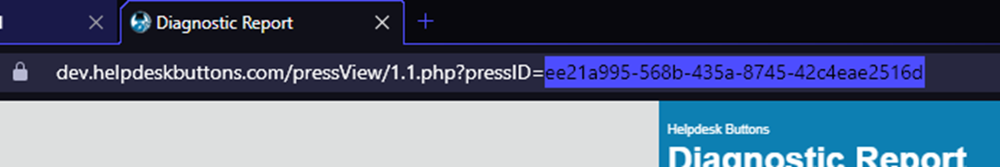
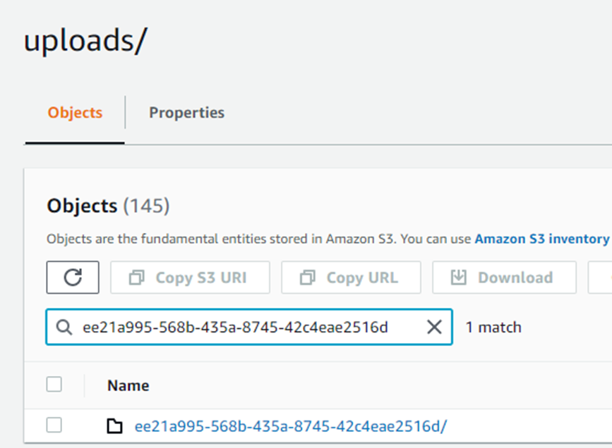
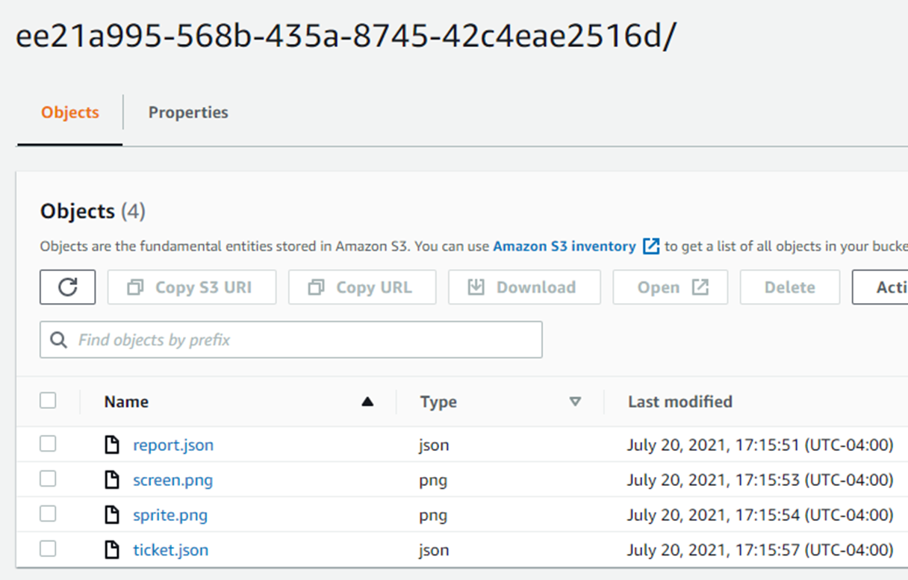
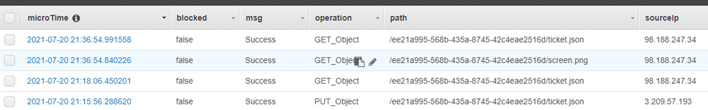

# Navigating your AWS 

## Accessing a specific reports files

Each ticket URL has a  “pressID” which corresponds to a folder in an S3 bucket

This is a folder in my test S3 bucket for uploads. 

*Note that the pressID can be used as a search term to find a folder*

You can find your uploads folder by logging into your AWS account, Selecting S3 as the service you want to use and selecting the bucket assigned to your Tier2Tickets account.

Inside this bucket will be two folders: 

- installers: where your latest installer is stored after it is built
- uploads: where the upload data is stored for each Tier2Tickets Report

### Finding a specific reports files

Inside that folder should be the data that is parsed for that report

## Logging Data

Additionally, in DynamoDB there should be entries in a table (created by the gatekeeper) that logs all the access for any ticket report.

These access portion of these raw logs is processed into a more readable format in our audit logs in your HDB/T2T account: 

[https://dev.helpdeskbuttons.com/auditReport.php](https://dev.helpdeskbuttons.com/auditReport.php)

