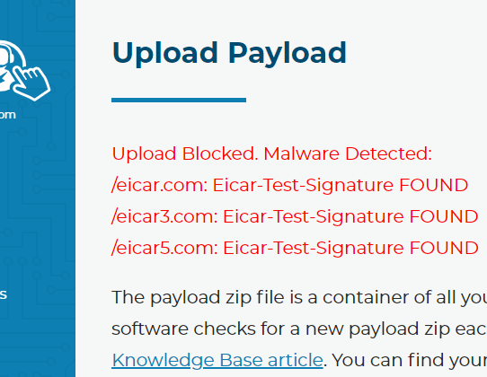

Security and Compliance
=========================

Tier 2 Tickets™ was built with data security in mind at each step of the ticket creation process, from initiation and transfer, to storage and access. We are proud of the product we have created, wrapped up in industry-leading security; going beyond the standard 2-factor authentication, auditing, and captchas, we have the option to host everything on a customer-controlled Amazon S3, IP filtering, and much more.
 
SECURITY
~~~~~~~~~

ButtonHelper
-------------

Our ButtonHelper executable runs on the system and takes screenshots when certain key inputs are hit by the user (mouse clicks, return, function keys, etc).

These screenshots are stored in memory until the user decides to submit a ticket. This data is never saved to disk. Once the ticket software is started, the collection scripts begin gathering information and processing the images into a compressed format. 

None of this information is sent from the machine without the affirmative consent of the user by default.

Custom Scripts
---------------

We allow users to create their own custom scripts and build them into the software. We scan these scripts with `ClamAV <https://www.clamav.net/>`_ and the helper files through a virus scanner before we allow them to be added to the builds, just in case. Other RMM platforms do not scan for malware for the things you upload and deploy. Although it might not always stop things, it’s better than doing nothing at all. This image is from a test via the Branding and Scripts page where you upload scripts.

Tier 2 Service
----------------

The system service is responsible for receiving commands to run and sends the output of those commands to our cloud infrastructure. It does this by establishing a WebSocket connection over TLS back to the command API. The TLS certificate of the cloud API must be valid for the connection to establish. Any commands coming into the service are also validated with an ECDSA signature. If the signature does not match the hardcoded public key, then the commands are ignored and the failure is logged.

The service also has the ability to send alerts/messages to the cloud services. To do so, the service must authenticate with the cloud servers by using a 256-bit authorization key that is unique to the machine and randomly generated upon install, or when the hard disk drive or motherboard serial number of the PC changes. This key is stored in the registry encrypted and the ACL of the registry key is such that non-administrators cannot view the value.

To the Cloud
~~~~~~~~~~~~~~~

Customer Controlled Amazon S3
------------------------------

The information is securely transmitted (HTTPS/TLS) and stored encrypted (AES256) in the cloud on the Amazon Web Services (AWS) storage platform: Amazon S3 (S3). By default, the data is stored on a set of S3 buckets that are controlled by Tier 2 Tickets. Upon request, we can change this hosting to an AWS instance that is owned and controlled by the customer.

For the software to function, we want the ability to access these files so ticket reports have the data they need, but we also want to bar any unauthorized access. In comes the Gatekeeper.

S3 Gatekeeper
--------------

The S3 Gatekeeper is a piece of code that now sits at the heart of the Tier 2 Tickets™ software. The job of the gatekeeper is to cryptographically verify every request that passes through it. It is the sole means by which data is sent to the S3 buckets and by which data leaves the S3 buckets. We took some pages out of Bitcoins’ playbook and implemented `Miltisig <https://en.bitcoin.it/wiki/Multisignature>`_. Each transaction (either a GetObject or PutObject) requires two digital signatures. One of the signatures is generated by us on our servers. The other one is generated by the gatekeeper, which sits on the AWS account owned by the customer. We decide whether to sign the request based on the authentication to our website. The gatekeeper decides based on a user-configurable ACL. The ACL supports IP based whitelisting and blacklisting.

We could have switched to just pulling that content from the gatekeeper, but then your data would have needed to flow through our servers to get rendered. That would just not do; we should not access your data ever. So we designed the report page so that all of the communication with the gatekeeper is done client-side and fetched with JavaScript. JavaScript then renders the page.

The end result is that you can blacklist even OUR servers’ IPs and everything continues to function as it should. Moreover, every transaction that takes place on the gatekeeper is put into a searchable audit log database that the customer has full control of in their AWS account.

We have open-sourced the gatekeeper codebase on `GitHub <https://github.com/tier2tickets/>`_ because we want to encourage peer-review of this vital piece of security software and we want the customers to know, without a doubt, that there are no loopholes and that their data is as safe as it should be. We also think the gatekeeper concept can help other products from other companies keep customer data safe and help meet regulatory compliances around the world.

Apart from logging into the S3 bucket directly, the only access anyone has with the data is through the Gatekeeper. This access is limited to countries that we operate in by default, (United States & Canada, United Kingdom, Australia, New Zealand, Ireland, Netherlands,) and is customizable.

To Your Techs
~~~~~~~~~~~~~~~

From an Integrated PSA
-----------------------

A high entropy randomized URL is generated for each ticket submission via Tier 2 Tickets™. This link is added to the ticket (as an internal/private/hidden note if possible.) A tech with access to the ticket system can use that link to get to the ticket so long as they are allowed to by an administrator on our website backend.

Website Backend
----------------

Viewing a ticket report generated via Tier 2 Tickets™ requires that you have the URL for that ticket, access via the Gatekeeper, and are signed into the `Tier 2 Tickets™ backend website <https://account.helpdeskbuttons.com/login.php>`_ under an account that has permission to view ticket reports.

2FA
----

Of course our site is protected with Multi-Factor Authentication using the same `TOTP <https://en.wikipedia.org/wiki/Time-based_One-time_Password_algorithm>`_ standard everything else does. It will work with any Multi-Factor App or generator you want to use.

Bot Protection (reCaptcha)
~~~~~~~~~~~~~~~~~~~~~~~~~~~~

Another type of protection, that is much more recognizable but deserves a mention, is reCaptcha. reCaptcha is all over the web, and for a good reason, it works. Most sites are using it for things like stopping forum spam, but it prevents other malicious bots and brute-force password attacks extremely well. Something that users of our site probably have not noticed though is that we use reCaptcha all over the place and you never see it.

This is because reCaptcha offers an `invisible option <https://developers.google.com/recaptcha/docs/invisible>`_, which stays completely out of the way unless there is reasonable suspicion that the user might not be human, then it springs into action asking you to click stop signs and traffic lights. The only sign that it is there protecting your account is this little symbol at the bottom right of the page.

Passwords
~~~~~~~~~~~

What you see here is the message that would pop up if you entered an insecure password to login to the site. What is NIST Special Publication 800-63b § 5.1.1.2? Well, NIST is the National Institute of Standards and Technology, and Special Publication 800-63b are the latest guidelines on digital authentication. There is some interesting stuff in there. For example, did you know that it is considered a poor security practice to require users to change their passwords periodically? Anyway, section 5.1.1.2 says that passwords should be checked against a list of passwords “obtained from previous breach corpuses.” There are `a lot of these <https://haveibeenpwned.com/PwnedWebsites>`_, and we use the `haveibeenpwned <https://haveibeenpwned.com/>`_ API to check against all known breached passwords each and every time you log in.

We should be clear that your password is never transmitted to a 3rd party. Rather, we send the first 2.5 bytes of the SHA-1 hash of the password and search the results for the remaining part of the hash.

The result is that, if you are using a password that is secure one day, but becomes insecure the next because it was publicized in a breach, we will be able to notify you next time you log in.

Suspicious Activity
~~~~~~~~~~~~~~~~~~~~~

Basically, we have a list of things that might be bad but we can’t be sure. Each of those things has a number of points assigned to it as to how suspicious that specific action really is. If you get 200 points during a set time window then we block your IP address. We are still fiddling with the numbers but right now it breaks down like this:

* Login: Invalid username: 20 points
* Login: Invalid password: 10 points
* 404: Page not found: 5 points
* 500: Server error: 10 points
* Password Reset failure (expired, invalid, or reused verification link): 5 points
* Invalid captcha: 5 points
* Change Account Email failure (expired, invalid, or reused verification link): 5 points
* Uploaded malware: 150 points
 
|
 
**Here is what it looks like if you get blocked:**

.. image:: images/blocked.png

Sub-accounts
~~~~~~~~~~~~~~

The main user account is created when the customer logs in for the first time. Additional accounts can be centrally managed on the Subaccount page. Each subaccount has its own 2FA key and set of permissions allowing certain site functionality.

.. image:: images/bob.png

When resetting the 2FA of a sub-user, a new one-time password for the 2FA is generated and must be delivered to the user before they can log back in.

The benefit of forcing everything to be authenticated by the site is that we can generate **audit logs** of all activity by the user. We know what ticket reports were viewed, by whom, when, where, and even if they downloaded frames from the slideshow or the slideshow itself.

IP Login Whitelists
~~~~~~~~~~~~~~~~~~~~~

Geo IP Whitelisting
--------------------

On this page, you will find that you can restrict access to log in by country, Internet Service Provider, and IP address. By default, we are blocking every country except the 7 countries we offer service in. This alone is a huge leap in security because most cyber-attacks originate from IP addresses located in `Russia and Ukraine <https://www.wordfence.com/blog/2017/06/may-2017-wordpress-attack-report/>`_.

ISP Whitelisting
-----------------

The center option allows you to whitelist by Internet Service Provider (ISP.) Your ISP is listed above and you can find the ISP for an IP address by using the link.

Anonymizer Detection
---------------------

At the bottom of that page, notice the “Block Anonymous IPs” option. This will block logins from IPs that are known to be Anonymous proxy servers, Anonymous VPNs, the `TOR network <https://www.torproject.org/>`_, Cloud hosting providers, or any other IP that might be hiding the actual location of the visitor. This helps the Country Code Whitelist mean something. Without it, a person in a non-whitelist country could still access the site if they were crafty.

How do we know if an IP is Anonymous? We use the `MaxMind <https://www.maxmind.com/en/geoip2-precision-services>`_ real-time insights service to check each and every login request. It costs us money each and every time someone logs in to get the insight data, and it’s among the more expensive APIs we use here, but it’s the industry-leading service for this type of information.

And only the best will do when it comes to protecting our users.

Compliance
~~~~~~~~~~~

At our MSP we mostly have to deal with HIPAA, but there are similar laws that cover other sectors other than healthcare and take similar approaches. The financial sector in the US, for example, has SOX (Sarbanes-Oxley Act.) The point is that we expected that our customers would have a need for regulatory compliance when using our software because of the screenshots that may contain very sensitive information. We, therefore, set out to design a system that can address these regulatory hurdles in an all-encompassing way.

HIPAA
------

We reached out to a HIPAA (Health Insurance Portability and Accountability Act) compliance attorney before we ever showed this software to anyone because our own MSP manages mostly medical practices. We knew that we needed to have certain, very specific features to comply with the strictest data security laws.

To meet this requirement we are required to provide additional layers of protection. That was the birthplace of the :ref:`Gatekeeper <content/privacy/security-overview:S3 Gatekeeper>`,  :ref:`per-user access restrictions <content/privacy/security-overview:Sub-accounts>` with audit logging, and :ref:`consent-based data transmission <content/privacy/security-overview:ButtonHelper>`. A :ref:`Customer Controlled Amazon S3 <content/privacy/security-overview:Customer Controlled Amazon S3>` account is required and we are prepared to sign a BAA (as well as have Amazon sign one.)

GDPR Compliance
-----------------

Working on it…Did you know that you have to have an employee representative in Europe to pass compliance? Pretty rough for a US-based company.

|

Download a PDF of the `Security and Compliance <https://drive.google.com/file/d/1veTkgj-VLQ4NG7AqA81qFKuOpL2YH6li/view>`_