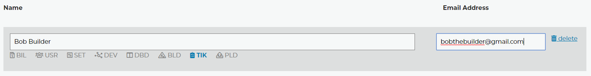
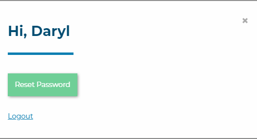

Sub-accounts
============

The Sub-account option is under the Administraton tab. Once you add a new user to the list, they will receive an email notification with a link to set their password. If you have two factor authentication enabled on the account (as you should), then this will be enforced on all of the sub-accounts as well. 
Each account, the main and all sub-accounts will have thier own 2FA code.   

To enable a permission click on its text. You can hover over the choices to see what they include. The image above would be a tech that needs to view ticket reports and see the ticket dashboard for instance.

- ADMIN: Provides access to Administration pages. It will select all other permissions since it also allows access to the sub-accounts page.
- AUTOMATIONS: Provides access to the Automations Systems. (Dispatcher Rules, Tier2Assist, Tier2Forms)
- BILLING: Provides access to Billing pages.
- DEVICE MGNT: Provides access to the Device Management Page and functions.
- SOFTWARE CORE: Provides Access to the Builds, Branding, and User interface pages.
- SOFTWARE ADV: Provides Access to Integration Settings and Tier2Scripts. 
- TICKETS: Provides access to PressView Reports. 
- TICKET DASH: Provides access to the Ticket Dashboard. 

By default sub-accounts can only access the *account overview*, the *help and support* page, and of course everyone is allowed to buy our buttons. 

Notice the configuration button in the top right corner of each page. 

Each account can reset its own password and log out via this menu. 

Main accounts have more options in this menu.

