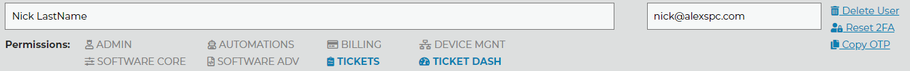

Sub-accounts
============

.. raw:: html

    

        <iframe width="560" height="315" src="https://www.youtube.com/embed/7jQ1Od_BBCI?start=48" frameborder="0" allow="accelerometer; autoplay; encrypted-media; gyroscope; picture-in-picture" allowfullscreen></iframe>
    

The main user account is created when the customer logs in for the first time. Additional accounts can be centrally managed on the Subaccount page. The Sub-account option is under the Administraton tab. Once you add a new user to the list, they will receive an email notification with a link to set their password. Each subaccount has its own 2FA key and set of permissions allowing certain site functionality. If you have two factor authentication enabled on the account (as you should), then this will be enforced on all of the sub-accounts as well. Each account, the main and all sub-accounts will have their own 2FA code.   

To enable a permission click on its text. You can hover over the choices to see what they include. The image above would be a tech that needs to view ticket reports and see the ticket dashboard for instance.

- ADMIN: Provides access to Administration pages. It will select all other permissions since it also allows access to the sub-accounts page.
- AUTOMATIONS: Provides access to the Automations Systems. (Dispatcher Rules, Tier2Assist, Tier2Forms)
- BILLING: Provides access to Billing pages.
- DEVICE MGNT: Provides access to the Device Management Page and functions.
- SOFTWARE CORE: Provides Access to the Builds, Branding, and User interface pages.
- SOFTWARE ADV: Provides Access to Integration Settings and Tier2Scripts. 
- TICKETS: Provides access to PressView Reports. 
- TICKET DASH: Provides access to the Ticket Dashboard. 

After changing permissions, sub-account users may need to log out and log back in to receive the new access permissions.

By default sub-accounts can only access the *account overview*, the *help and support* page, and of course everyone is allowed to buy our buttons. 

When resetting the 2FA of a sub-user, a new one-time password for the 2FA is generated and must be delivered to the user before they can log back in.

The benefit of forcing everything to be authenticated by the site is that we can generate **audit logs** of all activity by the user. We know what ticket reports were viewed, by whom, when, where, and even if they downloaded frames from the slideshow or the slideshow itself.

Notice the configuration button in the top right corner of each page. 

Each account can reset its own password and log out via this menu. 

Main accounts have more options in this menu.

