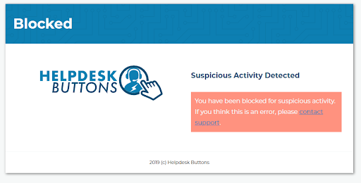

Suspicious Activity
====================

Basically, we have a list of things that might be bad but we can’t be sure. Each of those things has a number of points assigned to it as to how suspicious that specific action really is. If you get 200 points during a set time window then we block your IP address. We are still fiddling with the numbers but right now it breaks down like this:

* Login: Invalid username: 20 points
* Login: Invalid password: 10 points
* 404: Page not found: 5 points
* 500: Server error: 10 points
* Password Reset failure (expired, invalid, or reused verification link): 5 points
* Invalid captcha: 5 points
* Change Account Email failure (expired, invalid, or reused verification link): 5 points
* Uploaded malware: 150 points
 
|
 
**Here is what it looks like if you get blocked:**

