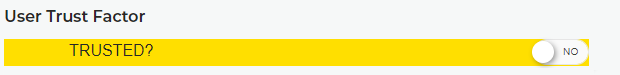

Human-Factor Verification
==================

A major feature of Tier2Tickets is ease of use for end users, which includes allowing end users to submit tickets without requiring a password. With surpassing password-based authentication, Tier2Tickets automatically provides a number of user verification steps that make it difficult to submit tickets as a third party, especially if you have the AD Sync/Identity Provider features turned on.

As Tier2Tickets provides the computer host name and the verified logged-in account with each ticket, it is very difficult for a user to impersonate a client. In fact, this means our system is as secure as the domain the tickets come from. However, if you prefer to use a third-party system for verification or you simply want to voice-verify clients, you can use our "Human-Factor verification" toggle to confirm that you are sure the user is who they say they are. 

Our proprietary system links the email address, MAC address, IP address, and username/domain for your customers' ticket report submissions. Once you have verified through whatever process you think is necessary (call, viewing screenshots, etc.) you or a tech that has access to tickets can toggle this to true, reporting the user signature as "Trusted". From then on, every submission that comes matching that exact signature will also come in as trusted, so your techs can proceed with confidence. 

If a user is not Human-Factor Verified as Trusted, it's a good flag for your technicians to verify a user's identity before executing the given request. 

Once the setting has been changed, a line giving details about who and when the setting was changed will be shown, regardless of the current state of the Human-Factor Verification status. The entire history of the changes to this setting is available on request.

This is what the Human-Factor Verification looks like in the report.

.. image:: images/trusted.png